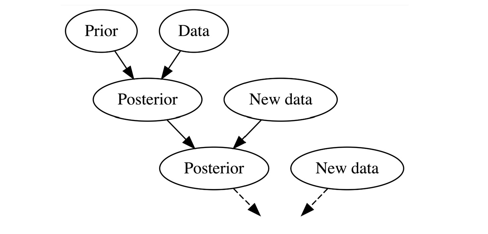

```{r, echo = FALSE}
# libraries
library(tidyverse)
library(dplyr)
library(ggplot2)
library(readr)
library(pander)
library(readxl)
library(knitr)
```

```{r, echo = FALSE}
# load data
clams <- read_csv("data/clams_clean.csv")
```


## Abstract

This study analyzes the growth rates of fossilized clams collected from lakes and rivers across Northern New York to draw conclusions about environmental conditions and how they may impact a bivalve's growth. Dr. Judith Nagel-Myers (Department of Biology and Geology) measured each clam grew during each annual period using shell growth rings. Since clam growth decreases with age, a Von Bertanfly growth model is applied to describe the relationship between shell length and age. To estimate each of the model's parameters, a Markov Chain Monte Carlo (MCMC) Algorithm was built using a Bayesian framework, which allows for uncertainty in the growth model parameters. Our objective is to determine if clam growth rate is different between lake environments and river environments.

## Introduction to Data

Clams grow through a process called accretion, where every growing period their shells expand by adding new material to the outer edge. This creates a new visible ring around the shell, similar to tree rings. The number and thickness of these rings depend on a variety of factors, such as climate, food availability, and water conditions.  These rings are preserved in fossilized clam shells, allowing geologists and paleontologists to make conclusions regarding historic clams ages and environmental conditions. 

The data used in this project was collected and recorded by Dr. Judith Nagel-Myers of the Geology and Biology Departments at St. Lawrence University in Canton, New York. She collected 151 fossilized valves from 17 different localities in Northern New York and Adirondack area.

The data set contains the following useful variables:

| Variable         | Explanation                                        |
|---------------|--------------------------------------------------|
| Location   | The lake or river that the clam originated from.                     |
| Body | Binary variable that indicates lake or river.  |
| Growth Period | Indicates stage of growth. 1 growth period represents 1 year of life.             |
| Length | Overall length of valve.                        |
| Growth | Total growth during specified growth period. |

## Introduction to Growth Model

For this study, the Von Bertanfly Growth Model was chosen because it is specifically designed to describe biological growth that slows over time, a growth pattern characteristic of bivalves. Unlike linear or exponential models, the Von Bertanfly Growth Model reflects the the often organisms grow rapidly in the early life stages and slow over time. This growth pattern makes the model well-suited for analyzing clam growth, especially when working with fossilized specimens where size and age relationships can be reconstructed. 

The model can be expressed as:

$$L(t) = max\_l \cdot (1 - e^{-k \cdot (t-b)})$$ 

where

-   $t$ is time.

-   $L(t)$ is mean length at time t.

-   $max\_l$ is the asymptotic length.

-   $k$ is how quickly the clams reaches $max\_l$.

-   $b$ is time where length is 0.

Together, these parameters allow for a detailed interpretation of growth patterns, making it possible to compare how clams develop under different environmental conditions and to infer environment quality and conditions from fossils. Below is a sample of the Von Bertanfly growth model. Take note of the exponential term which leads to the shape of the curve.

```{r, echo = FALSE}
# remove negative values from Coopers Falls, Lake Clear, Mirror Lake
clams <- clams |> filter(growth > 0 | is.na(growth) | growth == 0)

clams_norfolksm <- clams |>
  filter(location == "NorfolkSM") |>
  group_by(name)

von_bert_function <- function(t, max_l, k, b) {
  max_l * (1 - exp(-k * (t - b)))}

norfolksm_vb <- nls(Length ~ von_bert_function(growth_period, max_l, k, b),
  data = clams_norfolksm,
  start = list(max_l = max(clams_norfolksm$Length), k = 0.1, b = 0))

predict_norfolksm <- clams_norfolksm |>
  ungroup() |>
  mutate(predicted_length = predict(norfolksm_vb))

ggplot(predict_norfolksm,
  aes(x = growth_period, y = Length)) +
  geom_line(aes(group = name)) +
  geom_line(aes(y = predicted_length),
            color = "darkblue", linewidth = 2) +
  labs(x = "Growth Period", y = "Length",
       title = "Von Bertanfly Growth Curve Example") + 
  theme_minimal(base_size = 24, base_rect_size = 50) +
  theme(plot.title = element_text(size = 20, face = "bold", hjust = 0.5),
        axis.text.x  = element_text(size = 12),
        plot.subtitle = element_text(size = 16),
        axis.title.x = element_text(size = 16),
        axis.title.y = element_text(size = 16), 
        plot.caption = element_text(
        size = 14,     
        hjust = 0.5))   
```

This plot illustrates how the Von Bertanfly growth model describes the growth curve of a population of clams. Each black line represents the growth pattern of an individual clam. While there is a little variation from clam to clam, the overall structure of the growth curve is consistent across the group.

The blue line represents the Von Bertanfly growth curve for the entire population of clams, summarizing the group into a single curve. This curve illustrates the general relationship between age and size for the group. It creates a  model that represents the average growth of clams in this one location, environment, or population. 

## Data Exploration

This section will explore the data, looking to familiarize with the data's distributions and identify initial relationships between clam growth and water body. 

```{r, echo=FALSE}
# data predictions
clams_blacklake <- clams |>
  filter(location == "BlackLake") |>
  group_by(name)

blacklake_vb <- nls(Length ~ von_bert_function(growth_period, max_l, k, b),
  data = clams_blacklake,
  start = list(max_l = max(clams_blacklake$Length), k = 0.1, b = 0))

predict_blacklake <- clams_blacklake |>
  ungroup() |>
  mutate(predicted_length = predict(blacklake_vb)) 

clams_briggs <- clams |>
  filter(location == "Briggs") |>
  group_by(name)

briggs_vb <- nls(Length ~ von_bert_function(growth_period, max_l, k, b),
  data = clams_briggs,
  start = list(max_l = max(clams_briggs$Length), k = 0.1, b = 0))

predict_briggs <- clams_briggs |>
  ungroup() |>
  mutate(predicted_length = predict(briggs_vb)) 

clams_colton <- clams |>
  filter(location == "ColtonCanoeLaunch") |>
  group_by(name)

colton_vb <- nls(Length ~ von_bert_function(growth_period, max_l, k, b),
  data = clams_colton,
  start = list(max_l = max(clams_colton$Length), k = 0.1, b = 0))

predict_colton <- clams_colton |>
  ungroup() |>
  mutate(predicted_length = predict(colton_vb))

clams_copper <- clams |>
  filter(location == "CoppersFalls") |>
  group_by(name)

copper_vb <- nls(Length ~ von_bert_function(growth_period, max_l, k, b),
  data = clams_copper,
  start = list(max_l = max(clams_copper$Length), k = 0.1, b = 0))

predict_copper <- clams_copper |>
  ungroup() |>
  mutate(predicted_length = predict(copper_vb))

clams_dekalb <- clams |>
  filter(location == "DeKalb") |>
  group_by(name)

dekalb_vb <- nls(Length ~ von_bert_function(growth_period, max_l, k, b),
  data = clams_dekalb,
  start = list(max_l = max(clams_dekalb$Length), k = 0.1, b = 0))

predict_dekalb <- clams_dekalb |>
  ungroup() |>
  mutate(predicted_length = predict(dekalb_vb))

clams_eelweir <- clams |>
  filter(location == "EelWeir") |>
  group_by(name)

eelweir_vb <- nls(Length ~ von_bert_function(growth_period, max_l, k, b),
  data = clams_eelweir,
  start = list(max_l = max(clams_eelweir$Length), k = 0.1, b = 0))

predict_eelweir <- clams_eelweir |>
  ungroup() |>
  mutate(predicted_length = predict(eelweir_vb)) 

clams_govpark <- clams |>
  filter(location == "GovPark") |>
  group_by(name)

govpark_vb <- nls(Length ~ von_bert_function(growth_period, max_l, k, b),
  data = clams_govpark,
  start = list(max_l = max(clams_govpark$Length), k = 0.1, b = 0))

predict_govpark <- clams_govpark |>
  ungroup() |>
  mutate(predicted_length = predict(govpark_vb)) 

clams_heuvelton <- clams |>
  filter(location == "HeuveltonBoatLaunch") |>
  group_by(name)

heuvelton_vb <- nls(Length ~ von_bert_function(growth_period, max_l, k, b),
  data = clams_heuvelton,
  start = list(max_l = max(clams_heuvelton$Length), k = 0.1, b = 0))

predict_heuvelton <- clams_heuvelton |>
  ungroup() |>
  mutate(predicted_length = predict(heuvelton_vb))

clams_horseshoe <- clams |>
  filter(location == "HorseShoeLake") |>
  group_by(name)

horseshoe_vb <- nls(Length ~ von_bert_function(growth_period, max_l, k, b),
  data = clams_horseshoe,
  start = list(max_l = max(clams_horseshoe$Length), k = 0.1, b = 0))

predict_horseshoe <- clams_horseshoe |>
  ungroup() |>
  mutate(predicted_length = predict(horseshoe_vb)) 

clams_lakeclear <- clams |>
  filter(location == "LakeClear") |>
  group_by(name)

lakeclear_vb <- nls(Length ~ von_bert_function(growth_period, max_l, k, b),
  data = clams_lakeclear,
  start = list(max_l = max(clams_lakeclear$Length), k = 0.1, b = 0))

predict_lakeclear <- clams_lakeclear |>
  ungroup() |>
  mutate(predicted_length = predict(lakeclear_vb)) 

clams_lakeflower <- clams |>
  filter(location == "LakeFlower") |>
  group_by(name)

lakeflower_vb <- nls(Length ~ von_bert_function(growth_period, max_l, k, b),
  data = clams_lakeflower,
  start = list(max_l = max(clams_lakeflower$Length), k = 0.1, b = 0))

predict_lakeflower <- clams_lakeflower |>
  ungroup() |>
  mutate(predicted_length = predict(lakeflower_vb)) 

clams_lehman <- clams |>
  filter(location == "LehmanPark") |>
  group_by(name)

lehman_vb <- nls(Length ~ von_bert_function(growth_period, max_l, k, b),
  data = clams_lehman,
  start = list(max_l = max(clams_lehman$Length), k = 0.1, b = 0))

predict_lehman <- clams_lehman |>
  ungroup() |>
  mutate(predicted_length = predict(lehman_vb)) 

clams_longlake <- clams |>
  filter(location == "LongLake") |>
  group_by(name)

longlake_vb <- nls(Length ~ von_bert_function(growth_period, max_l, k, b),
  data = clams_longlake,
  start = list(max_l = max(clams_longlake$Length), k = 0.1, b = 0))

predict_longlake <- clams_longlake |>
  ungroup() |>
  mutate(predicted_length = predict(longlake_vb))

clams_massena <- clams |>
  filter(location == "Massena") |>
  group_by(name)

massena_vb <- nls(Length ~ von_bert_function(growth_period, max_l, k, b),
  data = clams_massena,
  start = list(max_l = max(clams_massena$Length), k = 0.1, b = 0))

predict_massena <- clams_massena |>
  ungroup() |>
  mutate(predicted_length = predict(massena_vb)) 

clams_mirror <- clams |>
  filter(location == "MirrorLake") |>
  group_by(name)

mirror_vb <- nls(Length ~ von_bert_function(growth_period, max_l, k, b),
  data = clams_mirror,
  start = list(max_l = max(clams_mirror$Length), k = 0.1, b = 0))

predict_mirror <- clams_mirror |>
  ungroup() |>
  mutate(predicted_length = predict(mirror_vb)) 

clams_mountain <- clams |>
  filter(location == "MountainLake") |>
  group_by(name)

mountain_vb <- nls(Length ~ von_bert_function(growth_period, max_l, k, b),
  data = clams_mountain,
  start = list(max_l = max(clams_mountain$Length), k = 0.1, b = 0))

predict_mountain <- clams_mountain |>
  ungroup() |>
  mutate(predicted_length = predict(mountain_vb)) 

clams_norfolk <- clams |>
  filter(location == "Norfolk") |>
  group_by(name)

norfolk_vb <- nls(Length ~ von_bert_function(growth_period, max_l, k, b),
  data = clams_norfolk,
  start = list(max_l = max(clams_norfolk$Length), k = 0.1, b = 0))

predict_norfolk <- clams_norfolk |>
  ungroup() |>
  mutate(predicted_length = predict(norfolk_vb)) 

clams_norfolksm <- clams |>
  filter(location == "NorfolkSM") |>
  group_by(name)

norfolksm_vb <- nls(Length ~ von_bert_function(growth_period, max_l, k, b),
  data = clams_norfolksm,
  start = list(max_l = max(clams_norfolksm$Length), k = 0.1, b = 0))

predict_norfolksm <- clams_norfolksm |>
  ungroup() |>
  mutate(predicted_length = predict(norfolksm_vb)) 

clams_norwood <- clams |>
  filter(location == "NorwoodBeach") |>
  group_by(name)

norwood_vb <- nls(Length ~ von_bert_function(growth_period, max_l, k, b),
  data = clams_norwood,
  start = list(max_l = max(clams_norwood$Length), k = 0.1, b = 0))

predict_norwood <- clams_norwood |>
  ungroup() |>
  mutate(predicted_length = predict(norwood_vb))

clams_piercefield <- clams |>
  filter(location == "Piercefield") |>
  group_by(name)

piercefield_vb <- nls(Length ~ von_bert_function(growth_period, max_l, k, b),
  data = clams_piercefield,
  start = list(max_l = max(clams_piercefield$Length), k = 0.1, b = 0))

predict_piercefield <- clams_piercefield |>
  ungroup() |>
  mutate(predicted_length = predict(piercefield_vb)) 

clams_pinestreet <- clams |>
  filter(location == "PineStreet") |>
  group_by(name)

pinestreet_vb <- nls(Length ~ von_bert_function(growth_period, max_l, k, b),
  data = clams_pinestreet,
  start = list(max_l = max(clams_pinestreet$Length), k = 0.1, b = 0))

predict_pinestreet <- clams_pinestreet |>
  ungroup() |>
  mutate(predicted_length = predict(pinestreet_vb)) 

clams_raquette <- clams |>
  filter(location == "RaquettePond") |>
  group_by(name)

raquette_vb <- nls(Length ~ von_bert_function(growth_period, max_l, k, b),
  data = clams_raquette,
  start = list(max_l = max(clams_raquette$Length), k = 0.1, b = 0))

predict_raquette <- clams_raquette |>
  ungroup() |>
  mutate(predicted_length = predict(raquette_vb)) 

clams_unionfallspond <- clams |>
  filter(location == "UnionFallsPond") |>
  group_by(name)

unionfallspond_vb <- nls(Length ~ von_bert_function(growth_period, max_l, k, b),
  data = clams_unionfallspond,
  start = list(max_l = max(clams_unionfallspond$Length), k = 0.1, b = 0))

predict_unionfallspond <- clams_unionfallspond |>
  ungroup() |>
  mutate(predicted_length = predict(unionfallspond_vb)) 

clams_southcoltonbridge <- clams |>
  filter(location == "SouthColtonBridge") |>
  group_by(name)

southcoltonbridge_vb <- nls(Length ~ von_bert_function(growth_period, max_l, k, b),
  data = clams_southcoltonbridge,
  start = list(max_l = max(clams_southcoltonbridge$Length), k = 0.1, b = 0))

predict_southcoltonbridge <- clams_southcoltonbridge |>
  ungroup() |>
  mutate(predicted_length = predict(southcoltonbridge_vb)) 

clams_tupperlakenorth <- clams |>
  filter(location == "TupperLakeNorth") |>
  group_by(name)

tupperlakenorth_vb <- nls(Length ~ von_bert_function(growth_period, max_l, k, b),
  data = clams_tupperlakenorth,
  start = list(max_l = max(clams_tupperlakenorth$Length), k = 0.1, b = 0))

predict_tupperlakenorth <- clams_tupperlakenorth |>
  ungroup() |>
  mutate(predicted_length = predict(tupperlakenorth_vb)) 

clams_tupperhorseshoe <- clams |>
  filter(location == "TupperHorseShoeLake") |>
  group_by(name)

tupperhorseshoe_vb <- nls(Length ~ von_bert_function(growth_period, max_l, k, b),
  data = clams_tupperhorseshoe,
  start = list(max_l = max(clams_tupperhorseshoe$Length), k = 0.1, b = 0))

predict_tupperhorseshoe <- clams_tupperhorseshoe |>
  ungroup() |>
  mutate(predicted_length = predict(tupperhorseshoe_vb)) 

# covariate data
covariate_data <- read_excel("data/covariate_data.xlsx")

# Bind growth predictions into one data set
predictions <- bind_rows(predict_unionfallspond, predict_southcoltonbridge, predict_tupperlakenorth, predict_tupperhorseshoe, predict_raquette, predict_pinestreet, predict_piercefield, predict_norwood, predict_norfolk, predict_norfolksm, predict_mountain, predict_mirror, predict_massena, predict_longlake, predict_lehman, predict_lakeclear, predict_lakeflower, predict_horseshoe, predict_heuvelton, predict_govpark, predict_eelweir, predict_dekalb, predict_copper, predict_colton, predict_briggs, predict_blacklake)

# add with lake/river data
clams_predictions_waterbody <- predictions |> left_join(covariate_data, by = "location")
```

Summary Statistics: 
```{r, echo=FALSE}
length_stats_river <- clams_predictions_waterbody |> 
  group_by(body) |>
  filter(body == "R") |> 
  summarise(
    mean = mean(Length),
    median = median(Length),
    sd = sd(Length),
    body = body) |>
  slice(1)

length_stats_lake <- clams_predictions_waterbody |> 
  group_by(body) |>
  filter(body == "L") |> 
  summarise(
    mean = mean(Length),
    median = median(Length),
    sd = sd(Length),
    body = body) |>
  slice(1)


length_stats <- bind_rows(length_stats_lake, length_stats_river)

pander(length_stats, caption = "Summary Statistics of Total Length: Lakes vs. River")
```
For lake clams, the mean length was 45.35 and the median was 44.69. Because these values are very close, the distribution appears approximately normal with little skew. The standard deviation was 13.95, indicating a moderate spread in clam sizes.

For river clams, the mean length was 60.98 and the median was 61.23. Again, the similarity between the mean and median suggests a normal distribution with little skew. The standard deviation was 14.83, which is comparable to that of lake clams.

Overall, river clams are larger on average than lake clams, indicating that clams in river environments tend to grow to greater lengths. Despite this difference in average size, the similar standard deviations suggest that the variability in clam size is about the same in both environments.

This table shows the average growth of lake and river clams during each growth period. The purpose of this table is to be able to understand how and when growth starts to slow, and compare growth characteristics between lake and river clams.
```{r, echo=FALSE}
growth_stats_lake <- clams_predictions_waterbody |>
  group_by(growth_period, body) |>
  summarise(
    mean = mean(growth),
    median = median(growth),
    sd = sd(growth)) |>
  filter(growth_period < 11)

pander(growth_stats_lake, caption = "Summary Statistics of Growth: Lakes vs. Rivers")
```
In both environments, growth decreases steadily as the clams age increases, which is consistent with the growth pattern described by the Von Bertanfly growth model. Comparing the two groups, lake and river clams grow similar amounts each growth period. 

Growth period 1 contains NA values because growth is defined as the change between  periods. Since no preceding growth period (growth period 0) exists, the growth for period 1 is undefined and therefore recorded as NA.

Next, the growth curve was modeled for all clams in the data set, regardless of whether the clam originated from a lake or a river. The purpose of this graph is to understand the growth patterns of the data as a whole. 

To create this plot, the growth function was run on every location, creating a growth curve for each locality, as represented by the black lines. The blue line represents the summarized growth curve for all the locations together, illustrating the fossilized clam estimated growth curve for all of Northern New York.  

```{r, echo=FALSE}
ggplot(data = clams_predictions_waterbody,  aes(x = growth_period, y = Length)) +
  geom_line(aes(y = predicted_length, group = location), linewidth = 1) +
  theme_bw() +
  labs(x = "Growth Period", y = "Length", title = "Growth Curves of All Clams") +
  geom_smooth()
```
This plot shows that clams tend to have faster growth rates at the beginning of their life, and slows as they get older. However, the timing of the transition from rapid to slower growth varies from location to location.

This graph illustrates the growth curves for lakes and rivers. The purpose of this plot is to be able to compare the growth curves between the two environments. 
```{r, echo=FALSE}
# plot to compare between lakes and rivers
ggplot(data = clams_predictions_waterbody,  aes(x = growth_period, y = Length)) +
  geom_line(aes(y = predicted_length, group = location), linewidth = 1) +
  theme_bw() +
  labs(x = "Growth Period", 
       y = "Length", 
       title = "Growth Curves by Lakes and Rivers") +
  theme(plot.title = element_text(size = 20, face = "bold", hjust = 0.5),
        axis.text.x  = element_text(size = 12),
        plot.subtitle = element_text(size = 16),
        axis.title.x = element_text(size = 16),
        axis.title.y = element_text(size = 16), 
        plot.caption = element_text(
        size = 14,     
        hjust = 0.5)) +
  facet_wrap(~body) + 
  geom_smooth()
```
The growth curves for lakes vs. river clams vary greatly. They have very different asymptotic lengths. This is because lake clams are much shorter than river clams. Additionally, it appears that lake clams start to reach their asymptotic length quicker than river clams.  

Overall, as we move into our analysis, we can see that growth rate is affected by age making this data a good candidate for the Von Bertanfly Growth model. But, more interestingly the body of water that the clams originates from appears to be an important factor in its growth, especially in terms of over length achieved and speed at which clams reach this length.

## Introduction to Bayesian Statistics

Fossils, since they are heavily exposed to the outdoors, are often broken or incomplete due to abrasion, erosion, or dissolution. As expected, many of the bivalves in the data are incomplete or broken, making it difficult to determine the true start of growth. Therefore, growth periods marked as growth period 1 are not always their first year of life. To account for these uncertainties, a Bayesian statistical framework is used. Bayesian statistics offer a more flexible approach that can account for uncertainty and missing information. This makes it good for this sort of paleontological data, where preservation is imperfect. 

Bayesian statistics works by combining prior knowledge with current knowledge to produce an updated understanding, known as the posterior distribution. As additional growth data is considered, the model is continuously updated, improving over time. 

```{r, echo=FALSE, fig.cap="Bayesian model diagram (Johnson et al. 2022)"}

```

## Bayesian Algorithm

For this study, I built an algorithm designed to estimate the parameters of the Von Bertanfly growth model while using a Bayesian framework to account for uncertainty. In this algorithm, we want to estimate four parameters of the Von Bertanfly growth model: $max\_l$, $k$, $b$, and $\sigma^2$. In the following model, the parameter $max\_l$ represents the maximum possible length for clams, $k$ represents the growth rate, $b$ represents time where length is 0, and $\sigma^2$ represents the variance and errors. 

$$L(t) = max\_l \cdot (1 - e^{-k \cdot (t-b)}) + \sigma^2$$ 

where

-   $t$ is time.

-   $L(t)$ is mean length at time t.

-   $max\_l$ is the asymptotic length.

-   $k$ is how quickly the clams reaches $max\_l$.

-   $b$ is time where length is 0.

-   $\sigma^2$ is variance. 

The algorithm runs twice, once for river clams and once for lake clams in order to compare the estimated parameters and results between the two bodies of water. 

To run the algorithm, we create and define the Von Bertanfly growth function to show shell length as a function of time using asymptotic length (max_l), growth rate (k), and time when length is zero (b). 

A key component of this algorithm is the prior and posterior distribution functions, which are computed next. The function compote_prior_log() specifies our prior knowledge about the model. It is a probability distribution, in this case a normal distribution, that represents our initials understandings or knowledge before considering the data. 

The posterior distribution function, compute_posterior_log, is the probability distribution function after taking in the new evidence provided by the dataset, also defined as a normal distribution. Here, the posterior distribution function is updated every time new data and knowledge is added and considered.

In simple terms, this part of the code repeatedly tests many possible values for each parameter until it finds values that best fit the data. It begins by setting initial starting values for all parameters. Then, a loop runs 10,000 times, and during each iteration the parameters are updated one at a time. Going parameter by parameter, the loop makes some adjustments, such as increasing or decreasing the parameter, and evaluates how that new value performs. If it improves the model, the new value for the parameter has a chance of being accepted. 

```{r, echo = FALSE}
# get and read data
clams <- read_csv("data/clams_clean.csv")
covariate_data <- read_excel("data/covariate_data.xlsx")
clams <- clams |> left_join(covariate_data, by = "location")

# remove negative values from Coopers Falls, Lake Clear, Mirror Lake
clams <- clams |> 
  filter(growth > 0) |>
  mutate(x = case_when(
    body == "L" ~ 1,
    body == "R" ~ 0)) 

# vb function

vb_function <- function(t, max_l, k, b) {
  max_l * (1 - exp(-k * (t - b)))}

# data for rivers
rivers <- clams |> 
  filter(body == "R") |>
  group_by(name)

# MCMC Algorithm

compute_prior_log <- function(max_l, k, b, sigma2) {
  dnorm(max_l, mean = 0, sd = 1000, log = TRUE) +
  dnorm(k, mean = 0, sd = 1000, log = TRUE) +
  dnorm(b, mean = 0, sd = 1000, log = TRUE) +
  log(1 / sigma2)
}

compute_likelihood_log <- function(max_l, k, b, sigma2) {
  dnorm(rivers$Length,
        mean =  vb_function(rivers$growth_period, max_l, k, b),
        sd = sqrt(sigma2), log = TRUE) |>
    sum()
}

compute_posterior_log <- function(max_l, k, b, sigma2) {
  compute_prior_log(max_l, k, b, sigma2) + 
    compute_likelihood_log(max_l, k, b, sigma2)
}


## set-up the chain
niter <- 10000

# set up three empty vectors, one for each parameter
max_l_store <- rep(NA, 10000)
b_store <- rep(NA, 10000)
k_store <- rep(NA, 10000)
sigma2_store <- rep(NA, 10000)
  
  
# define a starting value
max_l_store[1] <- 1.2
k_store[1] <- 0.3183
b_store[1] <- -0.8749
sigma2_store[1] <- 30
  
  
for (i in 2:niter) {
    
     ## start with max_l
  max_l_current <- max_l_store[i - 1]

  proposal_sd <- 3

  max_l_proposal <- rnorm(1, mean = max_l_current, sd = proposal_sd)

  alpha_l <- min(1, exp(compute_posterior_log(max_l_proposal, k_store[i-1], b_store[i-1], sigma2_store[i-1]) - compute_posterior_log(max_l_current, k_store[i-1], b_store[i-1], sigma2_store[i-1])))

  max_l_store[i] <- sample(c(max_l_proposal, max_l_current), size = 1,
                           prob = c(alpha_l, 1 - alpha_l))


  ## start K

  k_current <- k_store[i - 1]

  proposal_sd <- 0.05

  k_proposal <- rnorm(1, mean = k_current, sd = proposal_sd)


  alpha_k <- min(1, exp(compute_posterior_log(max_l_store[i], k_proposal, b_store[i-1], sigma2_store[i-1]) - compute_posterior_log(max_l_store[i], k_current, b_store[i-1], sigma2_store[i-1])))

  k_store[i] <- sample(c(k_proposal, k_current), size = 1,
                       prob = c(alpha_k, 1 - alpha_k))


  # start B

  b_current <- b_store[i - 1]

  proposal_sd <- 0.1

  b_proposal <- rnorm(1, mean = b_current, sd = proposal_sd)

  alpha_b <- min(1, exp(compute_posterior_log(max_l_store[i], k_store[i], b_proposal, sigma2_store[i-1]) - compute_posterior_log(max_l_store[i], k_store[i], b_current, sigma2_store[i-1])))

  b_store[i] <- sample(c(b_proposal, b_current), size = 1,
                       prob = c(alpha_b, 1 - alpha_b))

  # start sigma2

  sigma2_current <- sigma2_store[i-1]
  sigma2_current_log <- sigma2_current |> log()

  proposal_sd <- 0.2

  sigma2_proposal_log <- rnorm(1, mean = sigma2_current_log, sd = proposal_sd)
  sigma2_proposal <- exp(sigma2_proposal_log)

  alpha_sigma2 <- min(1, exp(compute_posterior_log(max_l_store[i], k_store[i], b_store[i], sigma2_proposal) + log(sigma2_proposal) - compute_posterior_log(max_l_store[i], k_store[i], b_store[i], sigma2_current) - log(sigma2_current)))

  sigma2_store[i] <- sample(c(sigma2_proposal, sigma2_current), size = 1,
                            prob = c(alpha_sigma2, 1 - alpha_sigma2))
}
  
  
plot_df_river <- tibble(iter = 1:niter, max_l = max_l_store, k = k_store, b = b_store,
                  sigma2_store) |> filter(iter > 2000)
```

```{r, echo = FALSE}
# Lakes

# get and read data
clams <- read_csv("data/clams_clean.csv")
covariate_data <- read_excel("data/covariate_data.xlsx")
clams <- clams |> left_join(covariate_data, by = "location")

# remove negative values from Coopers Falls, Lake Clear, Mirror Lake
clams <- clams |> 
  filter(growth > 0) |>
  mutate(x = case_when(
    body == "L" ~ 1,
    body == "R" ~ 0)) 

# vb function

vb_function <- function(t, max_l, k, b) {
  max_l * (1 - exp(-k * (t - b)))}

# data for lakes
lakes <- clams |> filter(body == "L") |> group_by(name)


compute_prior_log <- function(max_l, k, b, sigma2) {
  dnorm(max_l, mean = 0, sd = 1000, log = TRUE) +
  dnorm(k, mean = 0, sd = 1000, log = TRUE) +
  dnorm(b, mean = 0, sd = 1000, log = TRUE) +
  log(1 / sigma2)
}

compute_likelihood_log <- function(max_l, k, b, sigma2) {
  dnorm(lakes$Length,
        mean =  vb_function(lakes$growth_period, max_l, k, b),
        sd = sqrt(sigma2), log = TRUE) |>
    sum()
}

compute_posterior_log <- function(max_l, k, b, sigma2) {
  compute_prior_log(max_l, k, b, sigma2) + 
    compute_likelihood_log(max_l, k, b, sigma2)
}


## set-up the chain
niter <- 10000

# set up three empty vectors, one for each parameter
max_l_store <- rep(NA, 10000)
b_store <- rep(NA, 10000)
k_store <- rep(NA, 10000)
sigma2_store <- rep(NA, 10000)
  
  
# define a starting value
max_l_store[1] <- 1.2
k_store[1] <- 0.3183
b_store[1] <- -0.8749
sigma2_store[1] <- 30
  
  
for (i in 2:niter) {
    
     ## start with max_l
  max_l_current <- max_l_store[i - 1]

  proposal_sd <- 3

  max_l_proposal <- rnorm(1, mean = max_l_current, sd = proposal_sd)

  alpha_l <- min(1, exp(compute_posterior_log(max_l_proposal, k_store[i-1], b_store[i-1], sigma2_store[i-1]) - compute_posterior_log(max_l_current, k_store[i-1], b_store[i-1], sigma2_store[i-1])))

  max_l_store[i] <- sample(c(max_l_proposal, max_l_current), size = 1,
                           prob = c(alpha_l, 1 - alpha_l))


  ## start K

  k_current <- k_store[i - 1]

  proposal_sd <- 0.05

  k_proposal <- rnorm(1, mean = k_current, sd = proposal_sd)


  alpha_k <- min(1, exp(compute_posterior_log(max_l_store[i], k_proposal, b_store[i-1], sigma2_store[i-1]) - compute_posterior_log(max_l_store[i], k_current, b_store[i-1], sigma2_store[i-1])))

  k_store[i] <- sample(c(k_proposal, k_current), size = 1,
                       prob = c(alpha_k, 1 - alpha_k))


  # start B

  b_current <- b_store[i - 1]

  proposal_sd <- 0.1

  b_proposal <- rnorm(1, mean = b_current, sd = proposal_sd)

  alpha_b <- min(1, exp(compute_posterior_log(max_l_store[i], k_store[i], b_proposal, sigma2_store[i-1]) - compute_posterior_log(max_l_store[i], k_store[i], b_current, sigma2_store[i-1])))

  b_store[i] <- sample(c(b_proposal, b_current), size = 1,
                       prob = c(alpha_b, 1 - alpha_b))

  # start sigma2

  sigma2_current <- sigma2_store[i-1]
  sigma2_current_log <- sigma2_current |> log()

  proposal_sd <- 0.2

  sigma2_proposal_log <- rnorm(1, mean = sigma2_current_log, sd = proposal_sd)
  sigma2_proposal <- exp(sigma2_proposal_log)

  alpha_sigma2 <- min(1, exp(compute_posterior_log(max_l_store[i], k_store[i], b_store[i], sigma2_proposal) + log(sigma2_proposal) - compute_posterior_log(max_l_store[i], k_store[i], b_store[i], sigma2_current) - log(sigma2_current)))

  sigma2_store[i] <- sample(c(sigma2_proposal, sigma2_current), size = 1,
                            prob = c(alpha_sigma2, 1 - alpha_sigma2))
}
  
  
plot_df_lakes <- tibble(iter = 1:niter, max_l = max_l_store, k = k_store, b = b_store,
                  sigma2_store) |> filter(iter > 2000)
```

## Results

The results of the algorithm can be reported in two types of graphs: histograms and line plots. These plots demonstrate the distribution of the parameters attempted during each iteration through the algorithm. 

```{r, echo=FALSE}
# max_l plots
river_maxl_line = ggplot(data = plot_df_river, aes(x = iter, y = max_l)) +
  geom_line() +
  labs(x = "iter", y = "max_l",
       title = "max_l by Iteration for River Clams") + 
  theme_minimal(base_size = 24, base_rect_size = 50) +
  theme(plot.title = element_text(size = 20, face = "bold", hjust = 0.5),
        axis.text.x  = element_text(size = 12),
        plot.subtitle = element_text(size = 16),
        axis.title.x = element_text(size = 16),
        axis.title.y = element_text(size = 16))


river_maxl_hist = ggplot(data = plot_df_river, aes(x = max_l)) +
  geom_histogram(colour = "skyblue4", fill = "skyblue1", bins = 15)  +
  labs(x = "max_l", y = "frequency",
       title = "Histogram of max_l for River Clams") + 
  theme_minimal(base_size = 24, base_rect_size = 50) +
  theme(plot.title = element_text(size = 20, face = "bold", hjust = 0.5),
        axis.text.x  = element_text(size = 12),
        plot.subtitle = element_text(size = 16),
        axis.title.x = element_text(size = 16),
        axis.title.y = element_text(size = 16))

# k plots
river_k_line = ggplot(data = plot_df_river, aes(x = iter, y = k)) +
  geom_line() +
  labs(x = "iter", y = "k",
       title = "K by Iteration for River Clams") + 
  theme_minimal(base_size = 24, base_rect_size = 50) +
  theme(plot.title = element_text(size = 20, face = "bold", hjust = 0.5),
        axis.text.x  = element_text(size = 12),
        plot.subtitle = element_text(size = 16),
        axis.title.x = element_text(size = 16),
        axis.title.y = element_text(size = 16))


river_k_hist = ggplot(data = plot_df_river, aes(x = k)) +
  geom_histogram(colour = "skyblue4", fill = "skyblue1", bins = 15) +
  labs(x = "k", y = "frequency",
       title = "Histogram of k for River Clams") + 
  theme_minimal(base_size = 24, base_rect_size = 50) +
  theme(plot.title = element_text(size = 20, face = "bold", hjust = 0.5),
        axis.text.x  = element_text(size = 12),
        plot.subtitle = element_text(size = 16),
        axis.title.x = element_text(size = 16),
        axis.title.y = element_text(size = 16))

# b plots
river_b_line = ggplot(data = plot_df_river, aes(x = iter, y = b)) +
  geom_line()

river_b_hist = ggplot(data = plot_df_river, aes(x = b)) +
  geom_histogram(colour = "skyblue4", fill = "skyblue1", bins = 15)

# sigma2 plots
river_sigma2_line = ggplot(data = plot_df_river, aes(x = iter, y = sigma2_store)) +
  geom_line()

river_sigma2_hist = ggplot(data = plot_df_river, aes(x = sigma2_store)) +
  geom_histogram(colour = "skyblue4", fill = "skyblue1", bins = 15) +
  labs(x = "Sigma-Squared", y = "frequency",
       title = "Histogram of Sigma-Squared for Lake Clams") + 
  theme_minimal(base_size = 24, base_rect_size = 50) +
  theme(plot.title = element_text(size = 20, face = "bold", hjust = 0.5),
        axis.text.x  = element_text(size = 12),
        plot.subtitle = element_text(size = 16),
        axis.title.x = element_text(size = 16),
        axis.title.y = element_text(size = 16))
```

```{r, echo=FALSE}
# max_l plots
lakes_maxl_line = ggplot(data = plot_df_lakes, aes(x = iter, y = max_l)) +
  geom_line() +
  labs(x = "iter", y = "max_l",
       title = "max_l by Iteration for Lake Clams") + 
  theme_minimal(base_size = 24, base_rect_size = 50) +
  theme(plot.title = element_text(size = 20, face = "bold", hjust = 0.5),
        axis.text.x  = element_text(size = 12),
        plot.subtitle = element_text(size = 16),
        axis.title.x = element_text(size = 16),
        axis.title.y = element_text(size = 16))

lakes_maxl_hist = ggplot(data = plot_df_lakes, aes(x = max_l)) +
  geom_histogram(colour = "skyblue4", fill = "skyblue1", bins = 15) +
  labs(x = "max_l", y = "frequency",
       title = "Histogram of max_l for Lake Clams") + 
  theme_minimal(base_size = 24, base_rect_size = 50) +
  theme(plot.title = element_text(size = 20, face = "bold", hjust = 0.5),
        axis.text.x  = element_text(size = 12),
        plot.subtitle = element_text(size = 16),
        axis.title.x = element_text(size = 16),
        axis.title.y = element_text(size = 16)) 

# k plots
lakes_k_line = ggplot(data = plot_df_lakes, aes(x = iter, y = k)) + 
  geom_line() +
  labs(x = "iter", y = "k",
       title = "K by Iteration for Lake Clams") + 
  theme_minimal(base_size = 24, base_rect_size = 50) +
  theme(plot.title = element_text(size = 20, face = "bold", hjust = 0.5),
        axis.text.x  = element_text(size = 12),
        plot.subtitle = element_text(size = 16),
        axis.title.x = element_text(size = 16),
        axis.title.y = element_text(size = 16))

lakes_k_hist = ggplot(data = plot_df_lakes, aes(x = k)) +
  geom_histogram(colour = "skyblue4", fill = "skyblue1", bins = 15)+
  labs(x = "k", y = "frequency",
       title = "Histogram of k for Lake Clams") + 
  theme_minimal(base_size = 24, base_rect_size = 50) +
  theme(plot.title = element_text(size = 20, face = "bold", hjust = 0.5),
        axis.text.x  = element_text(size = 12),
        plot.subtitle = element_text(size = 16),
        axis.title.x = element_text(size = 16),
        axis.title.y = element_text(size = 16))

# b plots
lakes_b_line = ggplot(data = plot_df_lakes, aes(x = iter, y = b)) +
  geom_line()

lakes_b_hist = ggplot(data = plot_df_lakes, aes(x = b)) +
  geom_histogram(colour = "skyblue4", fill = "skyblue1", bins = 15)

# sigma2 plots
lakes_sigma2_line = ggplot(data = plot_df_lakes, aes(x = iter, y = sigma2_store)) +
  geom_line()

lakes_sigma2_hist = ggplot(data = plot_df_lakes, aes(x = sigma2_store)) +
  geom_histogram(colour = "skyblue4", fill = "skyblue1", bins = 15) +
  labs(x = "Sigma-Squared", y = "frequency",
       title = "Histogram of Sigma-Squared for Lake Clams") + 
  theme_minimal(base_size = 24, base_rect_size = 50) +
  theme(plot.title = element_text(size = 20, face = "bold", hjust = 0.5),
        axis.text.x  = element_text(size = 12),
        plot.subtitle = element_text(size = 16),
        axis.title.x = element_text(size = 16),
        axis.title.y = element_text(size = 16))
```

This plot below illustrates the results from the algorithm for the estimation of $max\_l$ for river clams. 
```{r, echo = FALSE}
river_maxl_line
```
The algorithm converged in the mid-80s, meaning this is the algorithm's estimation for the $max\_l$ parameter for river clams. Around this value, the graph begins to level off, suggesting that the estimate has stabilized. In the earlier iterations, the estimate increased steadily, but after roughly 4,000 iterations, it stopped increasing and remained close to the accepted value. The late convergence suggests that a different starting value for $max\_l$ should be used.

This plot below illustrates the results from the algorithm for the estimation of $max\_l$ for lake clams. 
```{r, echo = FALSE}
lakes_maxl_line
```
The algorithm converged at about 57, meaning this is the algorithm's estimation for the $max\_l$ parameter for lake clams. Around this value, the graph levels off, suggesting that the estimate has stabilized. Across all iterations the algorithm stayed consistent around this value, therefore it is the best estimate for this parameter. 

Between lake and river clams, lake clams have a significantly lower $max\_l$ than river clams. This means that the lake clams do not grow as long as river clams. 

This plot below illustrates the results from the algorithm for the estimation of $k$ for river clams. 
```{r, echo = FALSE}
river_k_line
```
This graph exhibits an atypical “blocking” pattern compared to the others. This occurs because the algorithm rarely accepts new values of $k$. In most cases, proposed updates do not improve the model, so they are rejected. As a result, the value of $k$ remains unchanged across many iterations, producing the distinct block-like appearance in the graph. The late convergence suggests that a different starting value for $k$ should be used.

This plot below illustrates the results from the algorithm for the estimation of $k$ for lake clams. 
```{r, echo = FALSE}
lakes_k_line
```
The algorithm converged at about 0.3, meaning this is the algorithm's estimation for the $k$ parameter for lake clams in the growth model. The algorithm stays relatively stable around this value, demonstrating that it converged at 0.3. 

This histogram below illustrates the frequency at which values for $max\_l$ were accepted by the algorithm for river clams. 
```{r, echo = FALSE}
river_maxl_hist
```
The most frequently accepted value is in the mid-80s, which aligns with our results from the line graph illustrate river clam's $max\_l$ results. The data is relatively normally distributed with no skew. 

This histogram below illustrates the frequency at which values for $max\_l$ were accepted by the algorithm for lake clams. 
```{r, echo = FALSE}
lakes_maxl_hist
```
This distribution is approximately normal, with a peak around 56, which represents the most frequently accepted value. The symmetric, bell-shaped form suggests that the algorithm converged relatively early and remained stable throughout the iterations.

This histogram below illustrates the frequency at which values for $k$ were accepted by the algorithm for river clams. 
```{r, echo = FALSE}
river_k_hist
```

This distribution is does not follow that of a typical bell-curve distribution. This atypical shape is caused by the low acceptance rate of k in the algorithm, as shown by the blocking pattern in the prior line plot. Because the algorithm is not accepting new k values, the algorithm reuses the same values for longer period of time, causing a concentration of accepted values at the peak. 

This histogram below illustrates the frequency at which values for $k$ were accepted by the algorithm for lake clams. 
```{r, echo = FALSE}
lakes_k_hist
```
This distribution is relatively normal with the peak around 0.27, which is consistent with the other results for lake clam's $k$ parameter. Specifically, the lack of skewness indicate that the burn-in period was small, meaning the algorithm stabilized early and produce consistent estimates across iterations. 

This table illustrates the median parameter estimates for the growth model for both lake and river clams as found by the algorithm. 
```{r, echo = FALSE}
results_river <- plot_df_river |>
  summarise(median_l = median(max_l),
            median_k = median(k),
            median_b = median(b),
            median_sigma2 = median(sigma2_store))|>
  mutate(body = "River")

results_lake <- plot_df_lakes |> 
  summarise(median_l = median(max_l),
            median_k = median(k),
            median_b = median(b),
            median_sigma2 = median(sigma2_store)) |>
              mutate(body = "Lake")
  

results <- bind_rows(results_lake, results_river)

pander(results, caption = "Parameter Estimates for Lakes and Rivers")
```

These results summarize the median parameter estimates for the growth curve between lake and river clams. They highlight key difference in growth between the two environments. 

For lake clams, the median $max\_l$ is much smaller than the $max\_l$ for river clams. However, $k$ is larger for lake clams than river clams. These results indicate that river clams grow to longer lengths when compared to lake clams. But, lake clams grow quicker and can reach their maximum length in a smaller amount of time. 

The variability between lake and river clams are also very different. Lake clams have much more variability in their size then river clams. This means that river clams length and growth are most consistent between each other than lake clams. 

## Conclusions and Discussion

River clams grow to longer overall lengths than lake clams, suggesting that environmental conditions in river aquatic systems that are more favorable for long term growth than lake environments. This could be due to currents, food availability, or acidity. Clam shells are made up of calcium carbonate, which can dissolve in acidic water. Lakes are more acidic than rivers, so one theory suggests that lake clams shells are dissolving as they are growing, explaining the smaller length. Another suggestion is that as filter feeders, clams rely on the water to pass nutrients by them. Since rivers have more aquatic movement, river clams have access to more food, allowing them to grow more. 

However, lake clams reach their asymptotic length approximately three times as fast as river clams. This means that they stop growing sooner and reach their maximum length quicker. This suggests that lake environments may support quick early development, but not long-term growth. Overall, these results suggest a trade-off between growth rate and final size: lake clams grow quickly but remain smaller, while river clams grow more slowly but reach larger sizes.

## Further Study

There are possible extensions of this study. First, would be to explicitly account for the uncertainty in timing. Currently, the model assumes that the first growth period aligns with the first yer of growth. This could be addresses by adding additional parameters into the model and algorithm. 

Another extension would be to expand the algorithm so that it estimates parameters for every single location individually. This would allow for study and comparison of individual locations. Using this, you could study which lake or river is the best or worst at supporting clam growth. This approach would look into environmental differences more deeply. 

## References

- Johnson, A. A., Ott, M. Q., & Dogucu, M. (2022). Bayes rules! An introduction to applied Bayesian modeling. https://www.bayesrulesbook.com/

- Windsland, K., Hvingel, C., Nilssen, E. M., & Sundet, J. H. (2013). Evaluation of von Bertalanffy growth curves for the introduced red king crab (Paralithodes camtschaticus) in Norwegian waters. Fisheries Research, 145, 15–21. https://doi.org/10.1016/j.fishres.2013.03.003

- Thank you to Dr. Judith Nagel-Myers for letting me use her data. 

## Appendix
```{r}
# get and read data
clams <- read_csv("data/clams_clean.csv")
covariate_data <- read_excel("data/covariate_data.xlsx")
clams <- clams |> left_join(covariate_data, by = "location")

# remove negative values from Coopers Falls, Lake Clear, Mirror Lake
clams <- clams |> 
  filter(growth > 0) |>
  mutate(x = case_when(
    body == "L" ~ 1,
    body == "R" ~ 0)) 

# vb function

vb_function <- function(t, max_l, k, b) {
  max_l * (1 - exp(-k * (t - b)))}

# data for rivers
rivers <- clams |> 
  filter(body == "R") |>
  group_by(name)

# MCMC Algorithm

compute_prior_log <- function(max_l, k, b, sigma2) {
  dnorm(max_l, mean = 0, sd = 1000, log = TRUE) +
  dnorm(k, mean = 0, sd = 1000, log = TRUE) +
  dnorm(b, mean = 0, sd = 1000, log = TRUE) +
  log(1 / sigma2)
}

compute_likelihood_log <- function(max_l, k, b, sigma2) {
  dnorm(rivers$Length,
        mean =  vb_function(rivers$growth_period, max_l, k, b),
        sd = sqrt(sigma2), log = TRUE) |>
    sum()
}

compute_posterior_log <- function(max_l, k, b, sigma2) {
  compute_prior_log(max_l, k, b, sigma2) + 
    compute_likelihood_log(max_l, k, b, sigma2)
}


## set-up the chain
niter <- 10000

# set up three empty vectors, one for each parameter
max_l_store <- rep(NA, 10000)
b_store <- rep(NA, 10000)
k_store <- rep(NA, 10000)
sigma2_store <- rep(NA, 10000)
  
  
# define a starting value
max_l_store[1] <- 1.2
k_store[1] <- 0.3183
b_store[1] <- -0.8749
sigma2_store[1] <- 30
  
  
for (i in 2:niter) {
    
     ## start with max_l
  max_l_current <- max_l_store[i - 1]

  proposal_sd <- 3

  max_l_proposal <- rnorm(1, mean = max_l_current, sd = proposal_sd)

  alpha_l <- min(1, exp(compute_posterior_log(max_l_proposal,
                                              k_store[i-1],
                                              b_store[i-1], 
                                              sigma2_store[i-1]) - 
                          compute_posterior_log(max_l_current, 
                                                k_store[i-1], 
                                                b_store[i-1], 
                                                sigma2_store[i-1])))

  max_l_store[i] <- sample(c(max_l_proposal, max_l_current), size = 1,
                           prob = c(alpha_l, 1 - alpha_l))


  ## start K

  k_current <- k_store[i - 1]

  proposal_sd <- 0.05

  k_proposal <- rnorm(1, mean = k_current, sd = proposal_sd)


  alpha_k <- min(1, exp(compute_posterior_log(max_l_store[i], 
                                              k_proposal, 
                                              b_store[i-1], 
                                              sigma2_store[i-1]) - 
                          compute_posterior_log(max_l_store[i], 
                                                k_current, 
                                                b_store[i-1], 
                                                sigma2_store[i-1])))

  k_store[i] <- sample(c(k_proposal, k_current), size = 1,
                       prob = c(alpha_k, 1 - alpha_k))


  # start B

  b_current <- b_store[i - 1]

  proposal_sd <- 0.1

  b_proposal <- rnorm(1, mean = b_current, sd = proposal_sd)

  alpha_b <- min(1, exp(compute_posterior_log(max_l_store[i], 
                                              k_store[i], 
                                              b_proposal, 
                                              sigma2_store[i-1]) - 
                          compute_posterior_log(max_l_store[i], 
                                                k_store[i], 
                                                b_current, 
                                                sigma2_store[i-1])))

  b_store[i] <- sample(c(b_proposal, b_current), size = 1,
                       prob = c(alpha_b, 1 - alpha_b))

  # start sigma2

  sigma2_current <- sigma2_store[i-1]
  sigma2_current_log <- sigma2_current |> log()

  proposal_sd <- 0.2

  sigma2_proposal_log <- rnorm(1, mean = sigma2_current_log, sd = proposal_sd)
  sigma2_proposal <- exp(sigma2_proposal_log)

  alpha_sigma2 <- min(1, exp(compute_posterior_log(max_l_store[i], 
                                                   k_store[i], 
                                                   b_store[i], 
                                                   sigma2_proposal) + 
                               log(sigma2_proposal) - 
                               compute_posterior_log(max_l_store[i], 
                                                     k_store[i], 
                                                     b_store[i], 
                                                     sigma2_current) - 
                               log(sigma2_current)))

  sigma2_store[i] <- sample(c(sigma2_proposal, sigma2_current), size = 1,
                            prob = c(alpha_sigma2, 1 - alpha_sigma2))
}
  
  
plot_df_river <- tibble(iter = 1:niter, 
                        max_l = max_l_store, 
                        k = k_store, 
                        b = b_store,
                        sigma2_store) |> 
  filter(iter > 2000)
```

```{r}
# Lakes

# get and read data
clams <- read_csv("data/clams_clean.csv")
covariate_data <- read_excel("data/covariate_data.xlsx")
clams <- clams |> left_join(covariate_data, by = "location")

# remove negative values from Coopers Falls, Lake Clear, Mirror Lake
clams <- clams |> 
  filter(growth > 0) |>
  mutate(x = case_when(
    body == "L" ~ 1,
    body == "R" ~ 0)) 

# vb function

vb_function <- function(t, max_l, k, b) {
  max_l * (1 - exp(-k * (t - b)))}

# data for lakes
lakes <- clams |> filter(body == "L") |> group_by(name)


compute_prior_log <- function(max_l, k, b, sigma2) {
  dnorm(max_l, mean = 0, sd = 1000, log = TRUE) +
  dnorm(k, mean = 0, sd = 1000, log = TRUE) +
  dnorm(b, mean = 0, sd = 1000, log = TRUE) +
  log(1 / sigma2)
}

compute_likelihood_log <- function(max_l, k, b, sigma2) {
  dnorm(lakes$Length,
        mean =  vb_function(lakes$growth_period, max_l, k, b),
        sd = sqrt(sigma2), log = TRUE) |>
    sum()
}

compute_posterior_log <- function(max_l, k, b, sigma2) {
  compute_prior_log(max_l, k, b, sigma2) + 
    compute_likelihood_log(max_l, k, b, sigma2)
}


## set-up the chain
niter <- 10000

# set up three empty vectors, one for each parameter
max_l_store <- rep(NA, 10000)
b_store <- rep(NA, 10000)
k_store <- rep(NA, 10000)
sigma2_store <- rep(NA, 10000)
  
  
# define a starting value
max_l_store[1] <- 1.2
k_store[1] <- 0.3183
b_store[1] <- -0.8749
sigma2_store[1] <- 30
  
  
for (i in 2:niter) {
    
     ## start with max_l
  max_l_current <- max_l_store[i - 1]

  proposal_sd <- 3

  max_l_proposal <- rnorm(1, mean = max_l_current, sd = proposal_sd)

  alpha_l <- min(1, exp(compute_posterior_log(max_l_proposal, 
                                              k_store[i-1], 
                                              b_store[i-1], 
                                              sigma2_store[i-1]) - 
                          compute_posterior_log(max_l_current, 
                                                k_store[i-1], 
                                                b_store[i-1], 
                                                sigma2_store[i-1])))

  max_l_store[i] <- sample(c(max_l_proposal, max_l_current), size = 1,
                           prob = c(alpha_l, 1 - alpha_l))


  ## start K

  k_current <- k_store[i - 1]

  proposal_sd <- 0.05

  k_proposal <- rnorm(1, mean = k_current, sd = proposal_sd)


  alpha_k <- min(1, exp(compute_posterior_log(max_l_store[i], 
                                              k_proposal, 
                                              b_store[i-1], 
                                              sigma2_store[i-1]) - 
                          compute_posterior_log(max_l_store[i], 
                                                k_current, 
                                                b_store[i-1], 
                                                sigma2_store[i-1])))

  k_store[i] <- sample(c(k_proposal, k_current), size = 1,
                       prob = c(alpha_k, 1 - alpha_k))


  # start B

  b_current <- b_store[i - 1]

  proposal_sd <- 0.1

  b_proposal <- rnorm(1, mean = b_current, sd = proposal_sd)

  alpha_b <- min(1, exp(compute_posterior_log(max_l_store[i], 
                                              k_store[i], 
                                              b_proposal, 
                                              sigma2_store[i-1]) - 
                          compute_posterior_log(max_l_store[i], 
                                                k_store[i], 
                                                b_current, 
                                                sigma2_store[i-1])))

  b_store[i] <- sample(c(b_proposal, b_current), size = 1,
                       prob = c(alpha_b, 1 - alpha_b))

  # start sigma2

  sigma2_current <- sigma2_store[i-1]
  sigma2_current_log <- sigma2_current |> log()

  proposal_sd <- 0.2

  sigma2_proposal_log <- rnorm(1, mean = sigma2_current_log, sd = proposal_sd)
  sigma2_proposal <- exp(sigma2_proposal_log)

  alpha_sigma2 <- min(1, exp(compute_posterior_log(max_l_store[i], 
                                                   k_store[i], 
                                                   b_store[i], 
                                                   sigma2_proposal) + 
                               log(sigma2_proposal) - 
                               compute_posterior_log(max_l_store[i], 
                                                     k_store[i], 
                                                     b_store[i], 
                                                     sigma2_current) - 
                               log(sigma2_current)))

  sigma2_store[i] <- sample(c(sigma2_proposal, sigma2_current), size = 1,
                            prob = c(alpha_sigma2, 1 - alpha_sigma2))
}
  
  
plot_df_lakes <- tibble(iter = 1:niter, 
                        max_l = max_l_store, 
                        k = k_store, 
                        b = b_store,
                  sigma2_store) |> 
  filter(iter > 2000)
```
